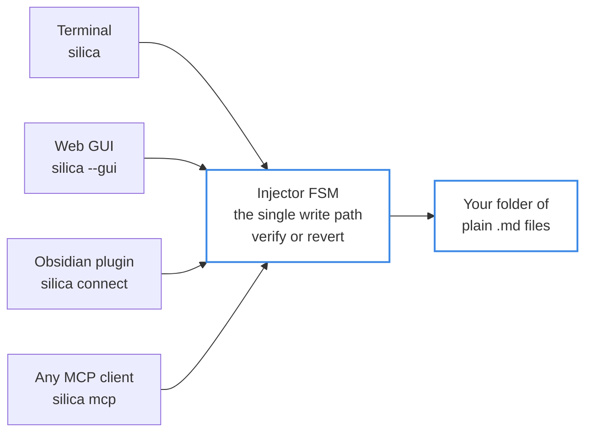
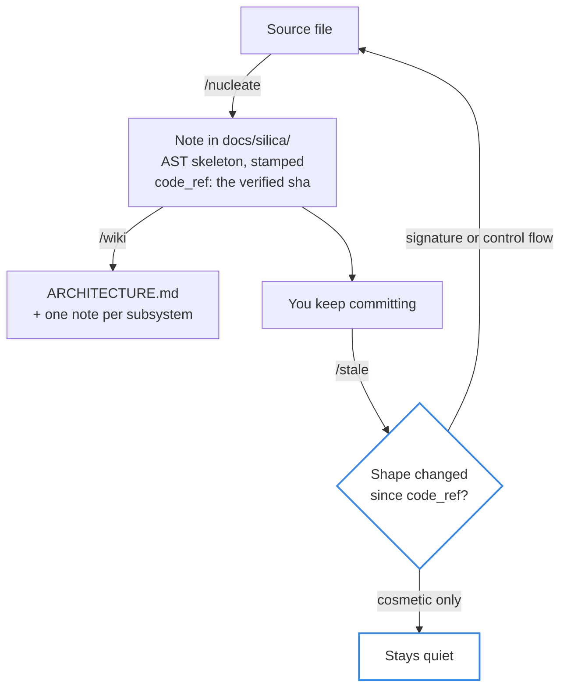

<p align="center">
  <picture>
    <source media="(prefers-color-scheme: light)" srcset="https://raw.githubusercontent.com/kiycoh/silica-harness/main/assets/banner-light.svg" />
    
  </picture>
</p>

<p align="center">
  <a href="https://deepwiki.com/kiycoh/silica-harness"></a>
  <a href="https://pypi.org/project/silica-harness/"></a>
  <a href="https://pypi.org/project/silica-harness/"></a>
  <a href="https://github.com/kiycoh/silica-harness/blob/main/pyproject.toml#L13">=3.11" /></a>
  <a href="https://obsidian.md"></a>
  <a href="https://github.com/GoogleCloudPlatform/knowledge-catalog/blob/main/okf/SPEC.md"></a>
  <a href="LICENSE"></a>
  <a href="https://ko-fi.com/kiycoh"></a>
</p>


<h3 align="center">
Silica gives any LLM the documents you actually keep.<br/>
Answers grounded in your own notes, and connections between them you would not have found.
</h3>

<p align="left">
On facts absent from its training data, hallucination has a statistical floor (<a href="https://arxiv.org/abs/2509.04664">OpenAI</a>), and a personal vault is made of exactly those facts.<br/>
Left editing over long workflows, even frontier models corrupt a quarter of a document (<a href="https://arxiv.org/abs/2604.15597">Microsoft</a>).<br/>
And in a growing knowledge base, the damage compounds: today's unchecked edit is retrieved as tomorrow's ground truth.
</p>

<p align="left">
Silica is the transactional write path for a folder of markdown: the model proposes, a parser<br/>
and an FSM verify and execute, and every write is re-read after it lands, reverted if it broke<br/>
something. Notes or a codebase, one vault holds both. Local-first, readable with or without it.
</p>

<p align="center">
  <a href="https://youtu.be/nYLiKTtMZuY">
    
  </a>
</p>

<p align="center">
  <sub><a href="https://youtu.be/nYLiKTtMZuY">▶ Watch the walkthrough</a> &nbsp;·&nbsp;
  a real vault nucleated, read, and mapped, in three minutes.</sub>
</p>

<p align="center">
  <b>82.1%</b> answerable accuracy and <b>~90%</b> correct refusals on LoCoMo &nbsp;·&nbsp;
  <b>100%</b> write integrity across a real 758-note vault<br/>
  <sub><a href="#measured">how these were measured</a></sub>
</p>

---

## Why Silica

### The problem

**Errors enter by construction.** A personal vault is the limiting case of that hallucination floor. Your decisions, your meetings, your half-finished ideas are not rare in the training data, they are absent from it, and the bound is not on facts the model saw once, it is on facts it never saw ([Kalai et al., 2025](https://arxiv.org/abs/2509.04664)). This is not a bug the next model release fixes.

**Errors compound.** What Microsoft's 25% is made of matters more than the number: sparse, severe errors that land silently, growing with document size, interaction length, and the count of distractor files in the folder ([Laban et al., 2026](https://arxiv.org/abs/2604.15597)). A vault is large, long-lived, and made almost entirely of distractors.

**Errors propagate.** A vault is not a pile of independent files, it is a linked graph that gets retrieved from, which is why corruption does not stay where it landed: the model links to the bad note, derives notes from it, answers out of it.

**And the two obvious outs are not outs.** Keep the assistant read-only and the vault rots on its own: the same idea captured five times, notes nothing points at any more, links to a file that moved, a subsystem documented against a commit from three months ago. Read-only also leaves the answering problem intact, the model still answers from its own memory or a stale note, and the answer reads the same either way. Or take the usual remedy, a tool that copies your notes into a store of its own: now the corpus being corrupted is one you cannot even open to check.

Silica takes the opposite position. **The vault is the product, not the transcript.** Your folder is the database, Silica is answerable for the state it is in, and every write it makes passes a gate that re-reads what it just wrote. Tested with local models (LM Studio, ollama-server) but it needs further testing on small models.

<sub><b>New to this?</b> A "vault" is just a folder of markdown (<code>.md</code>) files. If you already use Obsidian, that folder is your Obsidian vault, and Silica works on it directly.</sub>

**Try it before reading the rest.** Reading a vault needs no model and no API key, so one line hands your notes to an agent you already run:

```bash
silica setup claude             # or: setup codex, setup opencode
```

Nothing is asked, nothing else is configured, and nothing is written. Full [install](#install) below.

---

## How the guardrail works

<p align="center">
  
</p>

Code already survived this exact failure mode: software absorbs model-written changes because nothing lands unparsed. Compilers, type checkers, and test gates mechanically check what the model writes, and you let them reject and rewrite your work every day. Vaults had no equivalent. Silica puts an LLM's edits behind the same kind of guardrail:

| You already let a tool… | to guard against… | Silica does the same by… |
| :--- | :--- | :--- |
| a **compiler** reject source that will not build | syntax and type errors | an FSM refusing to commit a note that fails its structural checks |
| a **test suite** block a merge that breaks behavior | regressions | a post-write verify gate that reverts any edit which breaks vault coherence |
| **git** roll back a bad commit | losing history | `/undo` and `/revert` rolling back per note or per run |
| a **formatter** rewrite your code without asking | drift and inconsistency | graph-safe refactors that redirect links so a merge never orphans a note |

### Design contracts

Silica is not a free-form agent. Every vault mutation passes through a finite-state machine, and these are the invariants it enforces:

- **Single entry point.** All nucleation flows through the Injector FSM. There is no side channel that writes to the vault.
- **Verify or revert.** A post-write mismatch raises `VerifyMismatchError` and rolls the write back.
- **Graph-safe moves.** Renames, merges, and splits redirect incoming links atomically.
- **Zero-trust ingress.** External content such as web search results can only land in `Inbox/`, and reaches the vault only through explicit staging and FSM review.
- **Machine memory only by promotion.** What Silica learns from its own sessions becomes episodic facts outside the vault, never notes. It enters the vault only when you promote it, through the same gate as everything else.
- **Layered rollback.** `/undo` (per note), `/revert` (per run), and optional `SILICA_GIT_COMMIT=auto` stack as independent safety nets.

<p align="center">
  
</p>

> **Scope of the claim.** The guardrail is enforced today on the normal write path. It is not yet crash-verified: a harness that kills the process mid-write to prove the invariants survive failure is [in progress](#status). Read it as enforced control flow, not as a proof under adversarial faults. Back your vault up before letting any tool rewrite it, and keep git as the byte-level backstop.

---

## The pattern, and the format

Silica did not invent the artifact it curates. In April 2026 Andrej Karpathy wrote down the [LLM Wiki](https://gist.github.com/karpathy/442a6bf555914893e9891c11519de94f) pattern: keep the raw sources immutable, have the model compile them into a cross-linked markdown wiki, and have it maintain that wiki instead of rediscovering everything on every question. What a retrieval system would go looking for at query time is already synthesized, and the model does the bookkeeping a person will not: *"LLMs don't get bored, don't forget to update a cross-reference, and can touch 15 files in one pass."*

Two months later Google Cloud published the [Open Knowledge Format](https://cloud.google.com/blog/products/data-analytics/how-the-open-knowledge-format-can-improve-data-sharing), "an open specification that formalizes the LLM-wiki pattern into a portable, interoperable format": a directory of markdown files with YAML frontmatter, with no schema registry, no central authority, and no required tooling. [v0.2](https://cloud.google.com/blog/products/data-analytics/okf-v0-2-adds-trust-signals) added what an agent-maintained corpus needs before anyone can trust it: provenance, trust, lifecycle, and attestation.

Silica is that pattern with a gate in front of it, and the vault it curates is an OKF bundle as it stands:

- **[§11](https://github.com/GoogleCloudPlatform/knowledge-catalog/blob/main/okf/SPEC.md#11-conformance) conformance by construction, not by export.** Every note declares a `type`. Silica derives it from signals the kernel already keys on (a path under `sources/`, a code binding, a plan status) and stamps it at the single write seam, so there is no export step and no second copy of your notes. A `type` you wrote yourself is never overwritten, and §4.1 tolerates a vocabulary the spec has never heard of, so your own stays conformant. `silica doctor` censuses the vault against the three §11 clauses, and a one-shot backfill closes the gap on notes that predate the field.
- **§5.2 `verified`, the way back to the human tier.** Silica flags what it wrote, and a note it once touched used to rank as agent-authored forever after. A `verified:` entry naming a person restores the human trust tier. A machine actor does not qualify: a pipeline re-reading its own output is not a second opinion, and letting one count would hand the agent a lever on its own authority.

**What conformance covers.** The notes the vault owns. Silica does not force frontmatter onto markdown it did not write, because in a repository a `README` is markdown by right, and it does not generate the optional `index.md` bundle file. It does write the bundle-root `log.md`, the journal every run appends a line to, but flat and oldest-first rather than the newest-first date-grouped shape [§9](https://github.com/GoogleCloudPlatform/knowledge-catalog/blob/main/okf/SPEC.md#9-log-files) describes: the path is the spec's, the layout is not yet.

---

## Compared to the alternatives

The two nearest neighbors are worth naming. [Basic Memory](https://github.com/basicmachines-co/basic-memory) is the substrate twin: markdown on your disk, wikilinks, MCP, same AGPL license. [LLM Wiki](https://github.com/nashsu/llm_wiki) is the closest in ambition: a desktop app built on [the same pattern](#the-pattern-and-the-format), which compiles your documents into a wiki and keeps it current.

| | **Silica** | **Basic Memory** | **LLM Wiki** |
| :--- | :--- | :--- | :--- |
| Where the knowledge lives | your folder of `.md` | your folder of `.md` | a generated `wiki/` of markdown, beside sources kept immutable |
| After a write lands | re-read and checked, reverted on mismatch | written, then indexed | a `Lint` pass on demand, plus a review queue for what the model flagged |
| Undoing a bad edit | `/undo` per note, `/revert` per run, optional git commit per write | your own version control; point-in-time restore is a paid cloud tier | not a documented feature; deleting a source cascades cleanup of the pages it produced |
| Merge, split, rename | incoming wikilinks redirected atomically, no orphan left behind | the file moves, the links pointing at it are yours to fix | dead wikilinks pruned when a source is deleted |
| With no model available | retrieval degrades to deterministic legs and keeps answering | keyword search stays, semantic needs an embedder | keyword and graph search stay, ingest needs an LLM |
| Codebases | same vault, same gate, staleness checked against git | notes only | documents only |
| Refusal rate published | yes, 94.4% and 89.7% correct abstention next to 82.1% and 83.2% accuracy | not published | not published |
| Hosting | local, AGPL, nothing above it | local AGPL, plus a paid cloud tier | local, GPL-3.0 desktop app |

**The rest of the field.** Memory agents (Mem0, Zep, Letta, Cognee, Supermemory) ingest your material into a store of their own; Letta is the only one with rollback, and none of them verifies a write after it lands. Repo wiki agents (DeepWiki, OpenWiki, GitNexus, [Graphify](https://github.com/safishamsi/graphify)) read a codebase and emit an artifact next to it: good maps, read-only by design, and they never curate a human's notes. Graph frameworks (GraphRAG, LightRAG, HippoRAG, Graphiti) build an index, not a folder you can still open in a text editor.

### What only Silica does

- **Verify or revert on the memory substrate itself.** 2026 produced an entire memory-poisoning literature proposing exactly [the loop above](#how-the-guardrail-works), stage the write, validate it, commit or roll back: Cordon, MOSS, MemLineage, MemAudit, SMSR. Every one of them is a research prototype. Silica ships it, scope of the claim included.
- **A core that survives with no models at all.** The co-occurrence concept graph, the BM25 leg, and MinHash dedup need no embedder. Competitor cores are LLM-mandatory by construction, and the incentive runs that way: their business is the model call.
- **Notes and code as one substrate, behind one gate.** The split in the field is clean and nobody crosses it. Memory agents never touch a codebase; wiki agents never curate a human's notes.
- **Graph-safe mutation of links a human wrote.** Obsidian redirects links but has no agent driving it. Agents have no human link graph to keep intact. Silica has both.
- **Abstention as a published number.** Mem0's own 2026 benchmark write-up concedes the market underreports it. Silica prints correct refusals next to accuracy, and ships the [unflattering rows](#measured) unedited.

### What Silica did not invent

Credit where it is owed.

- **The wiki pattern itself** is Karpathy's and **the format that carries it** is Google's OKF, as [above](#the-pattern-and-the-format). What Silica adds is the gate in front of both, and it is the only part of this section it claims.
- **Plain markdown, local-first, AGPL** is the entry ticket to this category and Basic Memory got there too. Silica pays it in full, with no tier above the local one.
- **A graph with community detection and an interactive view** ships in Graphify, GitNexus, LLM Wiki, and GraphRAG. What Silica adds is that the same co-occurrence structure is also a retrieval leg.
- **Self-linking atomic notes** are A-MEM's thesis, and old news in Obsidian plugins. Silica's part is that those links survive a merge, a split, and a rename.
- **Staleness against the code** is Fiberplane Drift's reformat-immune AST fingerprint, Swimm sells it, OpenWiki schedules it. Silica runs it inside the vault that also holds your notes, and `/impact`, from a diff back to the notes it invalidates, is the piece almost nobody replicates.
- **Typed relations** are Graphiti's, with per-edge validity intervals Silica does not model, computed here on demand rather than frozen at ingest.
- **An MCP server and local models** are table stakes: four drivers, one gate, no privileged client.

---

## What you can do

**Clear an inbox without losing anything.**<br/>
Drop raw clippings, drafts, PDFs, or Jupyter Notebooks (`.ipynb`) in a folder. `/nucleate Inbox/*` distills each one into an atomic note, checks it against what you already have so you do not end up with a fifth copy of the same idea, and files it. Hand it twenty files at once and each one still goes through the same gate.

**Ask your notes instead of your memory.**<br/>
`/explain "<concept>"`, `/compare "A" "B"`, `/summarize <folder>`, `/quiz [note]`, `/learn <target>`. All grounded in the vault. Graded answers feed a learner model that estimates what you still retain from when each note was written and how you have scored since, so untargeted `/quiz` re-tests what is decaying and probes what was never measured, and `/learn` turns the same estimate into a step-by-step study plan over your own notes: what you did not know comes back, what you still know stays out of the way.

**When the vault does not have it.**<br/>
If every search a turn ran came back empty, Silica says so instead of answering thin, and names `/web`. Typing it is the consent: the answer comes from the web, with citations appended from the pages that were actually opened rather than from what the model claims it read. Fetching is direct, with no third-party reader in the path. That turn writes nothing; `/keep` saves it to the inbox when it was worth keeping, and `/web-search "<topic>"` does the same in bulk for a whole question.

**See the structure your notes already have.**<br/>
`/graph out.html` renders the vault as an interactive page, notes as nodes, communities colored and named, no server needed. `/map <note>` grows a radial mind-map out from a single note, written as an Obsidian canvas plus an SVG. Both local, both drawn from the same co-occurrence graph retrieval uses.

Reorganizing by intent, typed relation maps, reading paths, diagrams, contested claims, dedup, and the rest are in the [command reference](#command-reference).

---

## Install

The [one-liner above](#why-silica) writes the MCP server into your client's own config, and from the next session on your assistant can search, recall, and read your notes. That is the whole read path.

Writing notes needs a model. That is what the wizard is for:

```bash
uv tool install silica-harness    # or: pipx install silica-harness
silica init                     # interactive setup: vault, model, embeddings
silica                          # start the interactive session
```

If a provider key is already exported in your shell (`OPENROUTER_API_KEY`, `GEMINI_API_KEY`, `OPENAI_API_KEY`, `GROQ_API_KEY`, `DEEPSEEK_API_KEY`, `MISTRAL_API_KEY`, `XAI_API_KEY`), Silica picks a model for it and `silica init` stops asking which one.

`silica` curates the folder you launch it in (the repository root, when that folder is inside one). Your settings live in `~/.silica/.env` and follow you between folders. That file is the only one Silica reads: a `.env` belonging to whatever repository your shell happens to sit in is ignored, and a setting you want for one directory is that directory's job to export (`set -a; source .env; set +a`), which outranks the file.

Make a read-only audit your first move. It touches none of your notes (the report itself lands in `GRAPH_REPORT.md` at the vault root), and it shows you the hubs, bridges, and orphans already sitting in your vault:

```
/report
```

<details>
<summary><b>Optional features and development setup</b></summary>

<br/>

Extras install alone or combined, for example `'silica-harness[gui,mcp]'`:

```bash
uv tool install 'silica-harness[gui]'      # web GUI: silica --gui
uv tool install 'silica-harness[mcp]'      # MCP server: silica mcp
uv tool install 'silica-harness[connect]'  # Obsidian plugin bridge: silica connect
uv tool install 'silica-harness[pdf]'      # PDF nucleation
uv tool install 'silica-harness[rerank]'   # in-process cross-encoder rerank
uv tool install 'silica-harness[all]'      # everything above except dev
```

`[all]` inherits `[pdf]` and `[rerank]`, so it pulls torch and downloads several GB of model weights the first time those run.

Check your environment at any time with `silica doctor`. Add `--live` to send one tiny request that confirms the model really replies, or `--json` for the same report as a machine-readable payload (credentials in endpoint URLs are redacted). The exit code is 0 when every check passed, 1 when one failed, and 2 when nothing failed but a row needs reading (a warning, or a check that could not answer): a script should treat 2 as neither.

For development, clone and install editable instead (adds tests and linters), then prefix commands with `uv run`:

```bash
git clone https://github.com/kiycoh/silica-harness.git
cd silica-harness
uv pip install -e '.[dev]'
```

</details>

---

## Four ways in

One vault model, four drivers. What changes is who holds the write key.



<sub>Four front doors, one gate. Switching driver changes the interface, never the rules a write has to pass.</sub>

### 1. Web GUI &nbsp;·&nbsp; `silica --gui`

A chat-first interface at `http://localhost:8765`. Query and curate from the browser, watch answers stream in, open the graph. Start here if you are new.

### 2. Terminal &nbsp;·&nbsp; `silica`

The interactive REPL. Every command in the [reference](#command-reference) lives here, and it is the fastest driver once you know the verbs.

<p align="center">
  
</p>

<p align="center">
  <sub>A real 710-note vault, adopted as-is. An answer grounded in it, a structural audit of it,<br/>
  a write to it, and the same write taken back out.</sub>
</p>

### 3. Obsidian plugin &nbsp;·&nbsp; `silica connect`

A live bridge into the Obsidian desktop app: Silica reads and writes the vault you already have open, with rollback and cache behind every change, and every write shows up in a changes panel with a per-file diff. The plugin side lives in [kiycoh/obsidian-silica](https://github.com/kiycoh/obsidian-silica).

### 4. Agent memory &nbsp;·&nbsp; `silica mcp`

Silica serves your vault over stdio to any MCP client, so an assistant recalls your real notes and real decisions before it answers. One command line, `uvx --from 'silica-harness[mcp]' silica mcp`, and no model or API key on the read path: search, recall, and note reading run on the vault alone.

The vault is the folder the client was started in, the way a coding agent already works: open a project, get that project's vault. No path is written into the config, so the same entry serves every project.

A tool is passive, though: nothing makes an assistant call `silica_recall` on its own. So the server carries its own instructions (the recall/capture loop, put in front of the model by every client that surfaces them), a skill teaches the long form, and two hooks make the rest deterministic: `SessionStart` opens the session with the vault it is in, `SessionEnd` and `PreCompact` hand the transcript to `silica capture`. The three pieces live once in this repo (`mcp.json` with its Codex twin `mcp.codex.json`, `silica/skills/`, `hooks/hooks.json`), and the manifest for each harness points at them.

**Claude Code and Codex.** This repo is a plugin for both, so server, skill and hooks arrive together:

```bash
claude plugin marketplace add kiycoh/silica-harness
claude plugin install silica@silica

codex plugin marketplace add kiycoh/silica-harness   # then install silica from the plugins directory
```

`silica setup <client>` is the server-only path, and the one for clients without a plugin format. It writes the MCP entry into the client's config, and for Codex and DeepSeek Harness it also copies the skill to `~/.agents/skills/silica/`, the user root both discover:

```bash
silica setup claude      # delegates to `claude mcp add`
silica setup codex       # ~/.codex/config.toml, plus the skill
silica setup dsh         # ~/.dsh/cordis.patch.yml, plus the skill
silica setup opencode    # ~/.config/opencode/opencode.json
```

It backs the file up before touching it, leaves an existing `silica` entry alone, and takes `--dry-run` to print the block instead, or `--config <path>` for a project-local file.

**DeepSeek Harness** spawns the server once per `dsh web` process, in the folder you launched it from, so there the vault is that folder rather than each session's. Its `dsh-hooks-claude-code` bridge runs the plugin's `hooks/hooks.json` unchanged: add a row for it to the same patch file to get the session hooks too.

<details>
<summary><b>The same blocks by hand</b></summary>

<br/>

**Codex** (`~/.codex/config.toml`; the timeout covers a first-run `uvx` resolve, which outlasts the 10 s default):

```toml
[mcp_servers.silica]
command = "uvx"
args = ["--from", "silica-harness[mcp]", "silica", "mcp"]
startup_timeout_sec = 60
```

**DeepSeek Harness** (`~/.dsh/cordis.patch.yml`, a list of patches):

```yaml
- insert:
    - id: mcp-silica
      name: '@deepseek-ai/dsh-mcp-client'
      config:
        serverName: silica
        transport: stdio
        command: uvx
        args: ['--from', 'silica-harness[mcp]', 'silica', 'mcp']
```

**opencode** (`opencode.json`):

```json
{
  "mcp": {
    "silica": {
      "type": "local",
      "command": ["uvx", "--from", "silica-harness[mcp]", "silica", "mcp"],
      "enabled": true
    }
  }
}
```

Add `SILICA_VAULT` to the entry (an `env` table for Codex, `env` under `config` for DeepSeek Harness, `environment` for opencode) only to override the working directory and serve one fixed vault everywhere, which is what a headless run like a cron unit wants. An MCP client starts the server with its own environment, so any other setting the tools need (embedding endpoint, model) belongs in that same block rather than in a shell profile.

</details>

---

## How an answer is grounded

A question is not handed to one index and hoped for. It runs down independent legs, and the results are fused by rank:

<p align="center">
  
</p>

Fusing by rank is what lets legs that measure nothing comparable sit in the same pool: a cosine and an unbounded BM25 score never have to agree on a scale. And a leg with nothing useful to say **abstains** rather than emitting a flat ranking that would poison the pool, so fusion degrades to whichever legs survived.

That is the whole reason the two legs marked *no model* matter. They are deterministic and embedder-free, so with no embedding model at all, retrieval keeps working instead of failing. Each hit records its provenance, so an answer can name the note it came from.

The lexical leg is dotted because it is exactly that: optional. Build it with `/lexical` and it joins the same fusion, strong on the rare tokens, proper nouns, and dates that a semantic index is weakest on.

---

## Measured

Every number below comes from the harness in [`evals/`](evals/), run against the product path rather than a benchmark-only shortcut. Silica does not claim state of the art, and these say why: the samples are small, the judge is a local-grade model, and LoCoMo here is 2 of its 10 conversations. They are not comparable to what vendors report. They are something vendor numbers usually are not, which is re-runnable on your own machine.

| What was measured | Result | Sample |
| :--- | :--- | :--- |
| **LoCoMo**, questions the memory can answer | **82.1%** and **83.2%** accuracy | conv-26 (152 q) and conv-47 (150 q) |
| **LoCoMo**, questions it should refuse | **94.4%** and **89.7%** correct abstention | 47 q and 40 q |
| **MuSiQue** multi-hop retrieval | **61.3%** recall@10, **0.83** MRR | 50 questions over an 11,654-note vault |
| **Link recall** on a real vault: wikilinks stripped, then recovered | **68.8%** of the human's own links found again | 1,196 links across 393 notes |
| **Fused retrieval** on the same vault, masked pairs | **77.6%** recall@10 | 522 pairs |
| **Write integrity** on the same vault | **100%** (758 of 758) notes where no write transform introduces a new structural violation | 758 notes |

**How they were run.** LoCoMo ingests two of the ten conversations through the production FSM (`fsm-extractive`) and answers them with the production agent loop, `deepseek-v4-flash` as both answer and judge model, retrieval top-10 through the `bge-reranker-v2-m3` cross-encoder. MuSiQue is retrieval only, no answer model, embeddings plus co-occurrence fused at k=10. The three vault rows are the deterministic tier of the golden harness against a live 758-note Obsidian vault, frozen in [`evals/golden/baseline.json`](evals/golden/baseline.json). Additional evaluation probes in [`evals/`](evals/) measure **FactScore** factual precision (`factscore.py`), claim span attribution (`probe_explain_spans.py`), **LongMemEval** long-memory retention, and paired statistical significance testing (`paired_stats.py`).

```bash
uv run python -m evals.golden --vault ~/path/to/vault
uv run python -m evals.musique --vault BENCH_DIR --corpus musique_corpus.json --questions musique.json --load --index
uv run python -m evals.locomo --data locomo10.json --run-root RUN_DIR \
  --conversations conv-26,conv-47 --ingest fsm-extractive --answer agent
```

**And the numbers that do not flatter.** The same frozen baseline reports 0.33 agreement between `/organize` and the folders the human had already chosen, and 0.11 recall for concept-expanded correlation. They ship unedited next to the good ones.

---

## Point it at code

Point Silica at a repository instead of a note folder, by launching it there or setting `SILICA_VAULT`, and it keeps a human-readable map of the code under `docs/silica/`, kept honest against git.

- **`/nucleate <file>`** extracts a shallow AST skeleton with tree-sitter (signatures, structure, imports) and turns it into a markdown note, stamped with the commit it was verified against.
- **`/wiki`** grows that into a behavioral wiki: an `ARCHITECTURE.md` plus one note per subsystem.
- **`/stale`** flags notes whose source *changed in shape* since you documented it, meaning a signature or control-flow change rather than a reformat. **`/impact`** maps changed files to the notes they affect. You re-document what actually moved, not the whole tree.

The point is the loop, and git is what closes it:



<sub>A reformat is not a documentation debt. Only a real shape change is, and that is the difference `/stale` is built to make. `/impact` cuts the same question the other way: from a diff to the notes that document those files, plus their 1-hop neighbors.</sub>

One artifact, two readers: a human reads it as a current map of the repository, and a coding agent reads it over the [MCP server](#4-agent-memory--silica-mcp) to ground its work in the real structure instead of re-deriving it every session.

---

## Command reference

**Ask and audit** (read-only)

| Command | What it does |
| :--- | :--- |
| `/report [folder] [--embeddings] [--cooccurrence]` | Structural audit: hubs, bridges, orphans, autolink candidates |
| `/explain "<concept>" [--level=intro\|expert]` | Explain a concept grounded in the vault at the chosen register |
| `/summarize <note\|folder...>` | Read-only digest of one or more notes in chat |
| `/compare "A" "B"` | Comparison table; surfaces contradictions and contested notes |
| `/quiz [note\|folder] [--n=10]` | Active-recall quiz; misses resurface. No target = review queue (decaying + never-measured notes) |
| `/learn <area\|folder\|note\|topic>` | Guided re-learning: builds or resumes a syllabus note calibrated on what you still retain, teaches step by step with quiz gates |
| `/relate <note> [--n=8]` | Typed relationship map (prerequisite, elaborates, contradicts, etc.) |
| `/path <noteA> <noteB>` | Shortest reading path between two notes (wikilinks + co-occurrence) |
| `/schematize <target> [--save=<path>]` | Breakdown table of a note, folder, or topic (optional note save) |
| `/diagram <target> [--save=<path>]` | Mermaid diagram (flowchart, mindmap, sequence, class, timeline) |
| `/contested` | List notes flagged `contested: true` with unresolved contradictions |
| `/find <query>` | Semantic search |

**Bring in and reshape**

| Command | What it does |
| :--- | :--- |
| `/nucleate <file...> [--target=DIR]` | Notes/PDFs/Notebooks via the gate; code as skeletons |
| `/organize "<intent>" [--scope=DIR] [--file=tax.yaml] [--apply]` | Classify and move notes into a taxonomy |
| `/curate [--apply]` · `/dedup` · `/refine` · `/enrich` | Plan and run autolink, MinHash LSH dedup, and enrichment |
| `/aliases [folder] [--apply]` | Propose frontmatter aliases for note titles (abbreviations, spellings); autolink then resolves them |
| `/web [keywords]` | Answer from the web, cited from the pages opened; writes nothing. Bare `/web` re-asks your last question |
| `/keep` | Save the last `/web` answer as a cited note in the Inbox |
| `/web-search "<topic>" [--max-searches=N]` | Research on the web → cited findings note in Inbox |
| `/fetch <url>` | Read one page or YouTube transcript → verbatim note in Inbox |
| `/convert <file...>` | Transcode non-markdown files (PDFs) into markdown drafts |
| `/promote [<key>]` | List what session memory keeps repeating, promote one chain into a note through the gate |
| `/episodes [--save=<path>]` | Show what session memory holds, dated and grouped by key; writes nothing unless you name a path |
| `/agenda [today\|week\|YYYY-MM-DD]` | Per-day merge of events, dated notes, agent activity and review due; events live as calendar notes, reminders arrive in-app |

**Indexes** `/embed` · `/cooccur` (embedder-free) · `/lexical` (BM25 and fuzzy)

**Visualize** `/graph [out.html]` · `/map <note>` (radial mind-map canvas)

**Codebase** `/wiki` · `/stale` · `/impact [<range>]`

**Undo, inspect, and queue**

| Command | What it does |
| :--- | :--- |
| `/changes` | Every note this session wrote to, with added/removed line counts |
| `/undo [note]` | Undo the last patch on a note |
| `/revert [run-id]` | Revert a whole injection (per-run, LIFO) |
| `/status [run-id]` | Progress digest of the current/last batch run |
| `/review [--flush=HASH]` | Inspect or flush the async review queue (deferred operations) |
| `/plans` | List `plans/` notes grouped by status (`todo\|in-progress\|blocked\|done`) |

**System & Settings**

| Command | What it does |
| :--- | :--- |
| `/settings [<key> <value\|none>]` | View or edit `vault.yaml` settings without the wizard |
| `/vault [path]` | Show active vault or switch to another path for this session |
| `/help` · `/model` · `/tools` | Display help, current LLM model limits, or registered toolset |
| `/verbose` · `/thinking` · `/clear` · `/exit` | Cycle tool progress, toggle CoT reasoning, clear history, or exit |
| `/sessions [prune <days>d]` | List saved conversations for this vault (newest first); `prune` deletes narration sessions older than the given age |
| `/resume <n\|id>` | Reopen a saved conversation and continue it (`/new` starts a fresh one) |
| `/incognito` | Stop capturing the session you are in (capture is opt-in to begin with) |

---

## Configuration

`silica init` writes the essentials. The full list with defaults is in [`.env.example`](.env.example).

| Variable | Description |
| :--- | :--- |
| `SILICA_MODEL` | Chat model, litellm format (e.g. `openrouter/anthropic/claude-sonnet-4`) |
| `SILICA_PROVIDER` | `lmstudio` or `openrouter` |
| `SILICA_VAULT` | Vault path, adopted as-is. The working directory wins over this value unless it is exported in the environment (`SILICA_VAULT=... silica`, or an MCP client's `env` block). Reads cover the whole folder; writes are confined by `write_dir` in `vault.yaml` (a source tree declares `docs/silica`; a note folder declares `silica/`, a staging mirror of the vault tree you merge by pasting its contents over the root, and one toggle in `/settings` switches to writing in place) |
| `SILICA_EMBEDDING_MODEL` | Embedding model for semantic tasks (default `qwen3-embedding-4b`) |
| `SILICA_PROVIDER_SERVE_CMD` | Start command for the model endpoint; when set, Silica brings the server up itself whenever it finds it down. Same for `SILICA_EMBEDDING_SERVE_CMD` and `SILICA_RERANK_SERVE_CMD` |
| `SILICA_BACKEND` | `fs` (default, headless). The Obsidian bridge installs `ws` live at dial-in |
| `SILICA_GIT_COMMIT` | Git safety net for writes (`off`, `auto`) |
| `SILICA_TAVILY_API_KEY` | Optional: a backstop for `/web-search`, used only when DuckDuckGo rate-limits us. Search scrapes DuckDuckGo first either way, no key needed |
| `SILICA_WORKER_MODEL` | Sub-agent worker model, used for dedup and refinement |

---

## Status

Everything under **Available now** ships in the current release. Everything below it does not.

**Available now.** Note nucleation, structural audit, semantic and embedder-free search, graph-safe refactor / dedup / merge, graph and mind-map export, codebase skeletons with git-backed `/stale` and `/impact`, the code wiki, layered `/undo` and `/revert`, the git safety net, the MCP server, and the Claude Code / Codex plugin with its session hooks.

**Next, and it is the one that decides the rest.** Upkeep runs when you ask for it (`/curate`, `/organize`, `/stale`, `/report`). Being answerable for a folder means noticing without being asked, so the next work is scheduled upkeep: a folder watch, an audit that runs on its own, and a queue of changes waiting for your yes. Until it ships, Silica keeps the vault from rotting on demand, not on its own.

**In progress.** Richer codebase coverage across more languages, PDF/DOCX/TXT nucleation, the live Obsidian bridge, and the crash harness backing the guardrail.

**Planned.** Image nucleation.

---

## References

* **[Why Language Models Hallucinate](https://arxiv.org/abs/2509.04664)** (arXiv:2509.04664, 2025)
* **[LLMs Corrupt Your Documents When You Delegate](https://arxiv.org/abs/2604.15597)** (arXiv:2604.15597, 2026)
* **[From Agent Loops to Structured Graphs: A Scheduler-Theoretic Framework for LLM Agent Execution](https://arxiv.org/abs/2604.11378)** (arXiv:2604.11378, 2026)
* **[Goal-Autopilot: A Verifiable Anti-Fabrication Firewall for Unattended Long-Horizon Agents](https://arxiv.org/abs/2606.11688)** (arXiv:2606.11688, 2026)
* **[Is Your Agent Playing Dead? Deployed LLM Agents Exhibit Constraint-Evasive Fabrication and Thanatosis](https://arxiv.org/abs/2606.14831)** (arXiv:2606.14831, 2026)
* **[Reliable Graph-RAG for Codebases: AST-Derived Graphs vs LLM-Extracted Knowledge Graphs](https://arxiv.org/abs/2601.08773)** (arXiv:2601.08773, 2026)
* **[Predicting new research directions in materials science using large language models and concept graphs](https://doi.org/10.1038/s42256-026-01206-y)** (*Nature Machine Intelligence*, 2026)

The lineage of the artifact itself, as described in [The pattern, and the format](#the-pattern-and-the-format):

* **[LLM Wiki](https://gist.github.com/karpathy/442a6bf555914893e9891c11519de94f)** (Andrej Karpathy, April 2026), the pattern Silica extends
* **[Introducing the Open Knowledge Format](https://cloud.google.com/blog/products/data-analytics/how-the-open-knowledge-format-can-improve-data-sharing)** (McVeety and Hormati, Google Cloud, June 2026)
* **[OKF v0.2 specification](https://github.com/GoogleCloudPlatform/knowledge-catalog/blob/main/okf/SPEC.md)** ([GoogleCloudPlatform/knowledge-catalog](https://github.com/GoogleCloudPlatform/knowledge-catalog), Apache-2.0)

Silica's embedder-free near-duplicate detection (`/dedup`) is inspired by and ports the MinHash design from [Graphify](https://github.com/safishamsi/graphify).

---

## Contributing

Issues and pull requests welcome. See [CONTRIBUTING.md](CONTRIBUTING.md) for setup and conventions (English-only, conventional commits). By contributing you license your work under AGPL-3.0-or-later and grant the maintainer the right to relicense it (see the [License section](CONTRIBUTING.md#license) there). For security issues follow [SECURITY.md](SECURITY.md) and do not open a public issue.

## License

**GNU Affero General Public License v3.0.** Strong copyleft, no permissive fallback: anything incorporating Silica must itself be AGPL-3.0 with complete corresponding source offered to its users, and **§13** extends that to network use, so a modified version run as a hosted service owes source to the people using it. Full text in [LICENSE](LICENSE).
