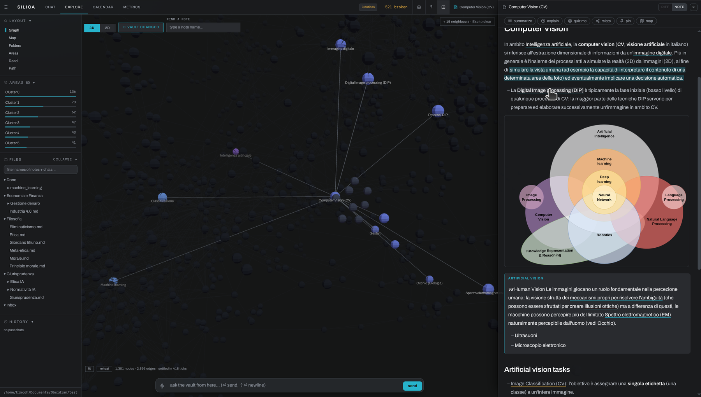
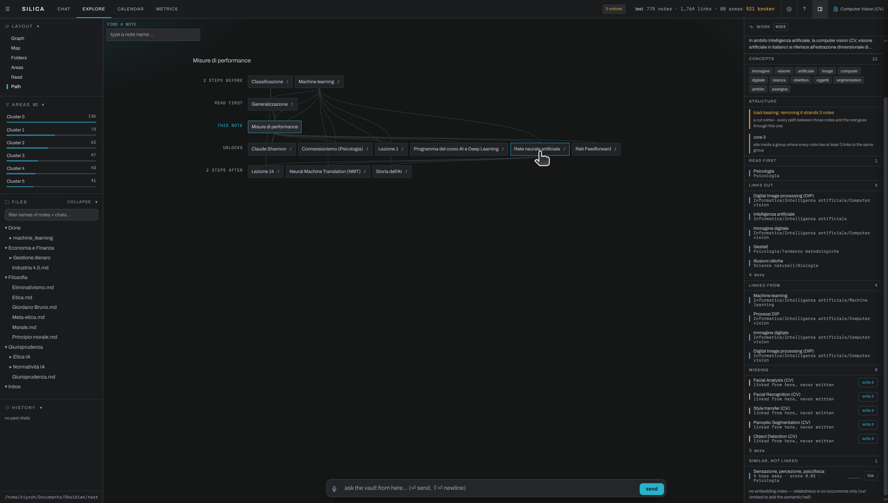
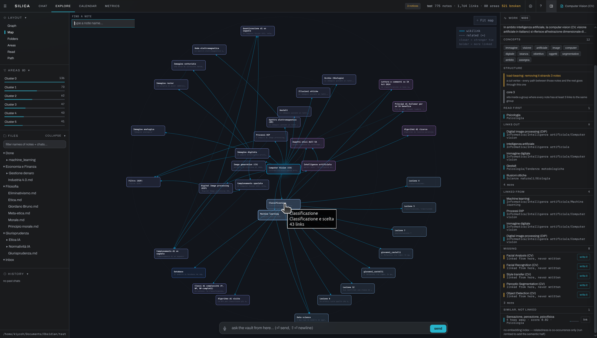
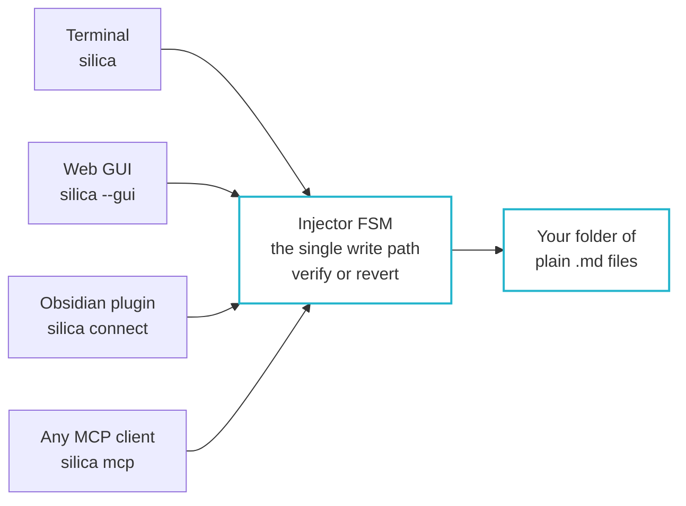
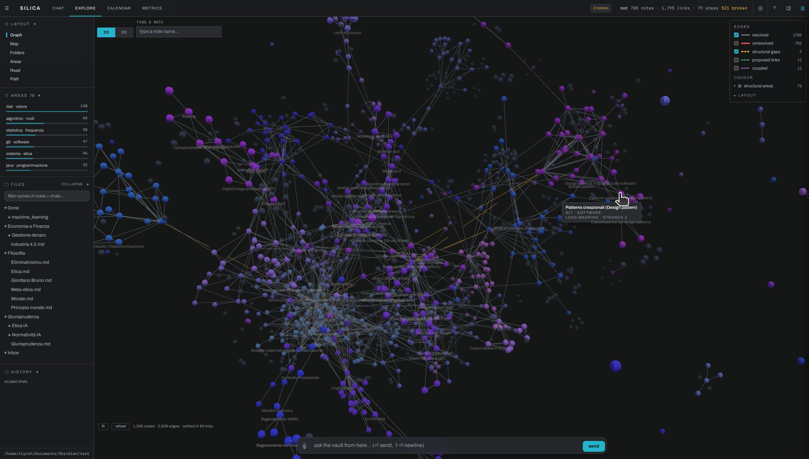
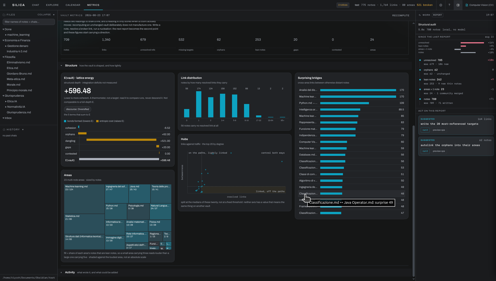
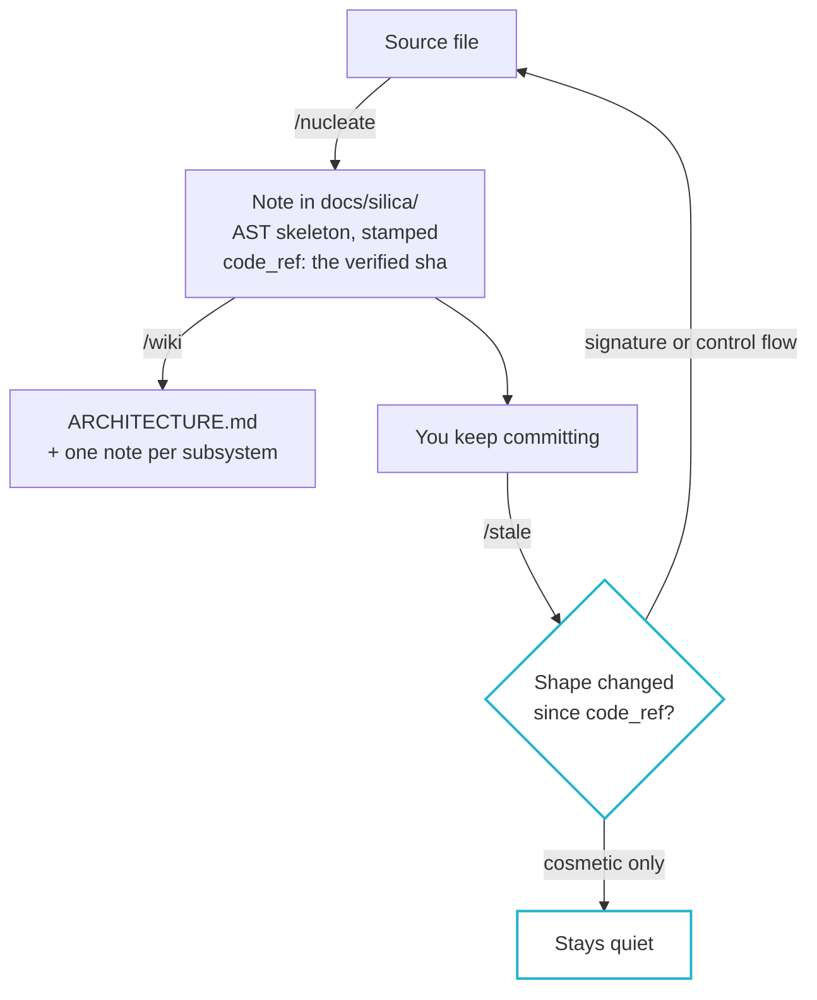

<p align="center">
  <picture>
    <source media="(prefers-color-scheme: light)" srcset="https://raw.githubusercontent.com/kiycoh/silica-harness/main/assets/banner-light.svg" />
    
  </picture>
</p>

<p align="center">
  <a href="https://deepwiki.com/kiycoh/silica-harness"></a>
  <a href="https://github.com/kiycoh/silica-harness/blob/main/pyproject.toml#L13">=3.11" /></a>
  <a href="https://obsidian.md"></a>
  <a href="https://github.com/GoogleCloudPlatform/knowledge-catalog/blob/main/okf/SPEC.md"></a>
  <a href="LICENSE"></a>
  <a href="https://ko-fi.com/kiycoh"></a>
</p>


<h3 align="center">
Silica is a multi-agent framework that allows one and more agents (human or artificial) to access and autonomously manage a knowledge base of information.
</h3>

<p align="center">
  <sub>
  An LLM harness to safely govern your digital notes. Auto-connections, a
  hand-rolled BM25, optional embedding with ~6% accuracy difference from a
  CPU-only fallback.
  <b>82.1%</b> answerable accuracy and <b>87.2%</b> correct refusals on LoCoMo, one run, both numbers
  &nbsp;·&nbsp;
  <b>100%</b> write integrity across a real 796-note vault <a href="#measured">(how these were measured)</a>
  Silica act as a transactional write path for a folder of markdown: the harness guides (e.g. ingestion, report..), the LLM proposes, a parser
  and an FSM verify and execute, and every write is verified against a source, reverted if corrupted. Codebases docs, Obsidian Vaults, Research material and more to come. Supports local inference.
  <sub>
<p>

<p align="center">
  <a href="#why-silica">Why</a> &nbsp;·&nbsp;
  <a href="#how-the-guardrail-works">Guardrail</a> &nbsp;·&nbsp;
  <a href="#what-you-can-do">What you can do</a> &nbsp;·&nbsp;
  <a href="#command-reference">Commands</a> &nbsp;·&nbsp;
  <a href="#four-interfaces-to-use-it">Interfaces</a> &nbsp;·&nbsp;
  <a href="#install">Install</a> &nbsp;·&nbsp;
  <a href="#configuration">Configuration</a> &nbsp;·&nbsp;
  <a href="#measured">Measured</a> &nbsp;·&nbsp;
  <a href="#point-it-at-code">Codebases</a> &nbsp;·&nbsp;
  <a href="#references">References</a>
</p>


<p align="center">
  <a href="https://youtu.be/nYLiKTtMZuY">
    
  </a>
</p>

<p align="center">
  <sub><a href="https://youtu.be/nYLiKTtMZuY">▶ Watch the walkthrough</a> &nbsp;·&nbsp;
  a real vault nucleated, read, and mapped, in three minutes. <i>A "vault" is just a folder of markdown (<code>.md</code>) files.</i></sub>
</p>


---

## Why Silica

### The problem

> On facts absent from its training data, hallucination has a statistical floor (<a href="https://arxiv.org/abs/2509.04664">Arxiv 2509.04664</a>), and a personal vault is made of exactly those facts.

> Left editing over long workflows, even frontier models corrupt a quarter of a document (<a href="https://arxiv.org/abs/2604.15597">Arxiv 2604.15597</a>).
> And in a growing knowledge base, the damage compounds: today's unchecked edit is retrieved as tomorrow's ground truth.

- **Errors enter by construction.** A personal vault is the limiting case of that hallucination floor. Your decisions, your meetings, your ideas are not rare in the training data, they are absent from it. The confidence is low facts it never saw ([Kalai et al., 2025](https://arxiv.org/abs/2509.04664)).

- **Errors compound.** What Microsoft's 25% is made of matters more than the number: sparse, severe errors that land silently, growing with document size, interaction length, and the count of distractor files in the folder ([Laban et al., 2026](https://arxiv.org/abs/2604.15597)). A vault is large, long-lived, and made almost entirely of distractors.

- **Errors propagate.** A vault is not a pile of independent files, it is a linked graph that gets retrieved from, which is why corruption does not stay where it landed: the model links to the bad note, derives notes from it, answers out of it.

### Silica's answer

- **A whole library goes through the gate one file at a time.** Point it at 200 PDFs and it is 200 transactions: this means that error compounding has nothing to accumulate in. The run is resumable and every file is separately revertible.
- **It does not summarize your documents, and that is worth 15 points.** Same pipeline either side, one variable: whether the note keeps the source's words or paraphrases them. The summarizing arm loses by [16.5 and 14.7 points](#measured) on two conversations, and is last in all four question categories on both.
- **Verify or revert on the memory substrate itself.** 2026 produced an entire memory-poisoning literature proposing exactly [a guardrail](#how-the-guardrail-works), stage the write, validate it, commit or roll back.
- **A core that survives with no models at all.** The co-occurrence concept graph, the BM25 leg, and MinHash dedup need no embedder.
- **Notes and code as one substrate, behind one gate.** The split in the field is clean and nobody crosses it. Memory agents never touch a codebase; wiki agents never curate a human's notes. Silica can.
- **Graph-safe mutation of links a human wrote.** Obsidian redirects links but has no agent driving it. Agents have no human link graph to keep intact. Silica has both.
- **Abstention as a published number.** Silica prints correct refusals next to accuracy, and ships the [unflattering rows](#measured) unedited.
- **The vault gets mapped holistically.** Communities are clustered over the links you wrote; zones are clustered over what the notes actually say.

<p align="center">
  
  <sub>Compilers, type checkers, and test gates mechanically check what the model writes, and you let them reject and rewrite your work every day. Vaults had no equivalent. Silica puts an LLM's edits behind the same kind of guardrail:</sub>
</p>

#### How an answer is grounded

A question is not handed to one index and hoped for. It runs down independent legs, and the results are fused by rank:

<p align="center">
  
</p>

Fusing by rank is what lets legs that measure nothing comparable sit in the same pool: a cosine and an unbounded BM25 score never have to agree on a scale. And a leg with nothing useful to say **abstains** rather than emitting a flat ranking that would poison the pool, so fusion degrades to whichever legs survived.

That is the whole reason the two legs marked *no model* matter. They are deterministic and embedder-free, so with no embedding model at all, retrieval keeps working instead of failing. Each hit records its provenance, so an answer can name the note it came from.

The co-occurrence leg weighs concepts with BM25 rather than raw frequency, which is what makes it worth fusing: on the test vault the same leg scores 0.51 recall@10 on raw counts and 0.86 with BM25, and once it does, per-leg weights and the fusion constant stop moving the result at all (ADR-0029). A third leg, note-to-note derived edges, was measured inside the same composition and removed: it recovered zero pairs the embedding leg did not already have.

The lexical leg is dotted because it is exactly that: optional. Build it with `/lexical` and it joins the same fusion, strong on the rare tokens, proper nouns, and dates that a semantic index is weakest on.

[Full install](#install) below.

---

## How the guardrail works

| You already let a tool… | to guard against… | Silica does the same by… |
| :--- | :--- | :--- |
| a **compiler** reject source that will not build | syntax and type errors | an FSM refusing to commit a note that fails its structural checks |
| a **test suite** block a merge that breaks behavior | regressions | a post-write verify gate that reverts any edit which breaks vault coherence |
| **git** roll back a bad commit | losing history | `/undo` and `/revert` rolling back per note or per run |
| a **formatter** rewrite your code without asking | drift and inconsistency | graph-safe refactors that redirect links so a merge never orphans a note |

---

## What you can do

- **Turn a folder of 200 PDFs into a vault, in one command.**<br/>
Drop raw clippings, drafts, papers, or Jupyter Notebooks (`.ipynb`) in a folder. `/nucleate Inbox/` takes the whole tree, and a glob, and a single file. Each one is its own transaction through the same gate, checked against what you already have so the fortieth paper does not become a fifth copy of an idea you already wrote down. What lands is the source's own sentences, not a summary of them, [measured at 0.961 atomic-fact precision](#measured) across a 237-note vault. Nothing is deleted: a finished source moves to `Done/` with its inbox folder structure intact, which is also how a run you stopped picks up where it left off, and `/revert --source <file>` takes one document's notes back out however far they spread.<br/>
Before you commit the afternoon, `scripts/bench_nucleate.py <folder> --sample 3` nucleates three files spread across the size distribution and extrapolates the rest by page count, so "how long would this library take" is answerable in minutes rather than by starting it and hoping.

- **Learn from your own documents, and be told when you are wrong.**<br/>
`/explain "<concept>"`, `/compare "A" "B"`, `/summarize <folder>`, `/quiz [note]`, `/learn <target>`. All grounded in the vault, and only in the vault: what it does not find there it refuses rather than fills in, and the [refusal rate is published](#measured) next to the accuracy, 87.2% correct on the questions a benchmark plants to be unanswerable. Graded answers feed a learner model that estimates what you still retain, so untargeted `/quiz` re-tests what is decaying and probes what was never measured, and `/learn` turns the same estimate into a step-by-step syllabus over your own notes.<br/>
It counts writing as learning and reading as nothing, which is the whole point: a note you wrote yourself starts with months of assumed retention, a note the model wrote for you starts with none until you answer a question about it correctly, and passive exposure never counts at all. Citing a note in a chat is not evidence you know it.<br/>
<br/>
<sub>A note open next to the graph it sits in, with summarize, explain, quiz and relate acting on that note in place.</sub>

- **Ask what two notes have to do with each other.**<br/>
`/path <A> <B>` walks the shortest reading path between any two notes, over your wikilinks *and* the concept graph, so it finds routes through notes you never linked by hand. `/relate <note>` names the kind of each relationship rather than just its strength, and `/compare` puts two notes in a table and surfaces where they contradict each other, which `/contested` then keeps as a standing list. This is the part that is hard to do by hand: the connection between two ideas you had four years apart is exactly the one you cannot remember you made.<br/>
<br/>
<sub>The same reading path in the browser: what to read before a note, what the note unlocks, and the step either side of both.</sub>

- **When the vault does not have it.**<br/>
If every search a turn ran came back empty, Silica says so instead of answering thin, and names `/web`. Typing it is the consent: the answer comes from the web, with citations appended from the pages that were actually opened rather than from what the model claims it read. Fetching is direct, with no third-party reader in the path. That turn writes nothing; `/keep` saves it to the inbox when it was worth keeping, and `/web-search "<topic>"` does the same in bulk for a whole question.

- **See the structure your notes already have.**<br/>
`/graph out.html` renders the vault as an interactive page, notes as nodes, communities colored and named, no server needed. `/map <note>` grows a radial mind-map out from a single note, written as an Obsidian canvas plus an SVG. Both local, both drawn from the same co-occurrence graph retrieval uses.<br/>
<br/>
<sub>The map grown out of a single note. Solid ties are wikilinks you wrote, dashed ties are relations the concept graph found; closer means stronger.</sub>

- **Take a write back out, however far it spread.**<br/>
Every note records where it came from, and the journal keeps that link, so `/revert --source <file>` takes back *every* run derived from one dropped PDF, not just the last one. `/undo` is the per-note step and `/revert <run-id>` the per-run one; `/changes` lists what this session touched with added and removed line counts, the same tally the GUI opens as a diff.

- **See time the way the vault already records it.**<br/>
`/agenda` merges one day's events, dated notes, agent activity, and what is due for review into a single column. Events are notes like any other, so the calendar is the vault read along its dates rather than a second store to keep in sync.<br/>
<br/>
<sub>One day opened: what the agent wrote that day, note by note, next to what is due for review.</sub>

Reorganizing by intent, typed relation maps, reading paths, diagrams, contested claims, dedup, and the rest are below, and `/help` prints the same list in any driver.

---

## Command reference

Every verb the registry knows, which is what `tests/test_readme_sync.py` compares this section against: a command that ships without a row here fails the suite rather than going unmentioned.

<details>
<summary><b>All 54 commands, grouped</b></summary>

<br/>

**Workflow: the ones that plan, read widely, or write**

| Command | What it does |
| :--- | :--- |
| `/report [folder] [--top-k=N] [--embeddings]` | structural audit of the vault -> steering loop |
| `/nucleate <file...> [--target=DIR] [--hub=H]` | bring files in: notes via Injector FSM, code as skeleton stubs |
| `/promote [<key>]` | session memory -> a note: list what keeps recurring, promote one through the gate |
| `/web [keywords]` | answer from the web instead of the vault, cited; bare /web re-asks your last question |
| `/organize "<intent>" [--scope=FOLDER] [--file=taxonomy.yaml] [--merge] [--move-uncategorized] [--apply]` | classify and reorganize vault notes according to a taxonomy |
| `/summarize <note|folder...>` | read-only digest of one or more notes in chat (key points, tables) |
| `/explain "<concept>" [--level=intro|expert]` | explain a concept grounded in the vault, at the chosen register |
| `/compare "<A>" "<B>" [...]` | comparison table of notes/concepts; surfaces contradictions |
| `/quiz [note|folder] [--n=10]` | active-recall quiz; graded answers resurface the notes you miss. No target = review queue |
| `/learn <area|folder|note|topic>` | guided re-learning: builds (or resumes) a syllabus note calibrated on what you still retain, then teaches step by step with quiz gates |
| `/relate <note> [--n=8]` | typed relationship map: how/why one note relates to its vault neighbors |
| `/schematize <note|folder|topic> [--save=<path>]` | Markdown table schematizing a note, folder, or topic |
| `/diagram <note|folder|topic> [--save=<path>]` | Mermaid diagram of a note, folder, or topic |

**Direct: one action, no agent loop**

| Command | What it does |
| :--- | :--- |
| `/episodes [--save=<path>]` | show what session memory holds: live chains, dated, grouped by key; writes nothing |
| `/agenda [today|week|YYYY-MM-DD]` | per-day merge of events, dated notes, agent activity and review due |
| `/convert <file...> [--target=DIR]` | transcode a non-.md file (PDF) into a markdown note in the inbox |
| `/web-search "<concept>" [--max-searches=N]` | research a concept on the web -> cited findings note in the Inbox (then /nucleate) |
| `/keep` | save the last /web answer as a cited note in the Inbox (then /nucleate) |
| `/fetch <url>` | read one URL (YouTube gives its transcript) -> verbatim note in the Inbox |
| `/status [run_id]` | progress digest of the last run |
| `/embed [folder] [--force]` | build/update embedding index |
| `/cooccur [folder] [--force]` | build/update co-occurrence index (without embedder) |
| `/lexical [folder] [--force]` | build/update lexical (BM25/fuzzy) index |
| `/wiki [folder|path] [--overview-only] [--force]` | behavioral code wiki: ARCHITECTURE.md + one note per subsystem |
| `/graph [out.html] [folder]` | export knowledge graph |
| `/map <note> [--force]` | radial mind-map rooted on a note -> maps/<stem>.canvas |
| `/find <query> [--k=N]` | semantic search |
| `/changes` | notes this session wrote to, with added/removed line counts |
| `/undo [note-path]` | undo the last patch on a note |
| `/review [--flush=HASH]` | inspect the async review queue (deferred ops) |
| `/revert [run-id | --source <file>]` | revert a whole injection (per-run, LIFO), or every run derived from one source |
| `/dedup [folder]` | deduplicate (sub-agent) |
| `/curate [folder] [--apply]` | curate the vault: plan autolink/orphan/dedup/refine work (dry-run; --apply executes) |
| `/aliases [folder] [--apply]` | propose frontmatter aliases for note titles (abbreviations, spellings); dry-run, --apply writes |
| `/refine [folder]` | enrich and normalize notes (sub-agent) |
| `/enrich [folder]` | enrich note semantics (sub-agent) |
| `/stale [--all]` | list notes whose documents: sources changed structurally (--all includes cosmetic) |
| `/impact [<git-range>]` | changed files -> affected notes (documenting + 1-hop import neighbors); no range = uncommitted changes |
| `/plans` | list plans/ notes grouped by status: (todo\|in-progress\|blocked\|done) |
| `/path <noteA> <noteB>` | shortest reading path between two notes (wikilinks + co-occurrence) |
| `/contested` | list notes flagged contested: true with their unresolved contradictions |

**Session and settings**

| Command | What it does |
| :--- | :--- |
| `/sessions [prune <days>d]` | list saved conversations (narration + legacy); prune deletes old ones |
| `/resume <n|id>` | reopen a saved conversation and continue it |
| `/new` | start a fresh conversation (same as /clear); the old one stays resumable |
| `/vault [path]` | show the active vault, or switch to another for this session |
| `/settings [<key> <value|none>]` | view or edit vault.yaml settings (language, tags) without the wizard |
| `/help` | show this help |
| `/model` | show the current LLM model |
| `/tools` | list registered tools |
| `/clear` | reset conversation history |
| `/verbose` | cycle tool progress: off -> new -> all -> verbose |
| `/thinking` | toggle display of the reasoning block |
| `/incognito` | toggle capture of this session off |
| `/exit` | exit silica |

</details>

---

## Four interfaces to use it

One vault model, four drivers. What changes is who holds the write key.



<sub>Four front doors, one gate. Switching driver changes the interface, never the rules a write has to pass.</sub>

### 1. Web GUI &nbsp;·&nbsp; `silica --gui`

A chat-first interface at `http://localhost:8765`. Query and curate from the browser, watch answers stream in, and switch to three other tabs on the same vault: the **graph**, in 2D or 3D, with communities and semantic zones as separate colour keys; a **calendar** that shows what already happened next to what is booked; and **metrics**, which reports what moved since the last run rather than only the current state. A long job narrates itself while it runs, and every write it makes lands in a drawer with its own diff. Start here if you are new.

<p align="center">
  
</p>

<p align="center">
  <sub>The whole vault in 3D, 1,306 notes and 2,609 edges. Areas name themselves from the terms their notes share,<br/>
  each edge type is its own toggle, and hovering a note says which area it sits in and what cutting it would strand.</sub>
</p>

### 2. Terminal &nbsp;·&nbsp; `silica`

The interactive REPL. Every command lives here, `/help` lists them grouped, and it is the fastest driver once you know the verbs.

<p align="center">
  
</p>

<p align="center">
  <sub>A real 710-note vault, adopted as-is. An answer grounded in it, a structural audit of it,<br/>
  a write to it, and the same write taken back out.</sub>
</p>

### 3. Obsidian plugin &nbsp;·&nbsp; `silica connect`

A live bridge into the Obsidian desktop app: Silica reads and writes the vault you already have open, with rollback and cache behind every change, and every write shows up in a changes panel with a per-file diff. The plugin side lives in [kiycoh/obsidian-silica](https://github.com/kiycoh/obsidian-silica).

### 4. Agent memory &nbsp;·&nbsp; `silica mcp`

Silica serves your vault over stdio to any MCP client, so an assistant recalls your real notes and real decisions before it answers. One command line, `uvx --from 'silica-harness[mcp]' silica mcp`, and no model or API key on the read path: search, recall, and note reading run on the vault alone.

The vault is the folder the client was started in, the way a coding agent already works: open a project, get that project's vault. No path is written into the config, so the same entry serves every project.

A tool is passive, though: nothing makes an assistant call `silica_recall` on its own. So the server carries its own instructions (the recall/capture loop, put in front of the model by every client that surfaces them), a skill teaches the long form, and two hooks make the rest deterministic: `SessionStart` opens the session with the vault it is in, `SessionEnd` and `PreCompact` hand the transcript to `silica capture`. The three pieces live once in this repo (`mcp.json` with its Codex twin `mcp.codex.json`, `silica/skills/`, `hooks/hooks.json`), and the manifest for each harness points at them.

**Claude Code and Codex.** This repo is a plugin for both, so server, skill and hooks arrive together:

```bash
claude plugin marketplace add kiycoh/silica-harness
claude plugin install silica@silica

codex plugin marketplace add kiycoh/silica-harness   # then install silica from the plugins directory
```

`silica setup <client>` is the server-only path, and the one for clients without a plugin format. It writes the MCP entry into the client's config, and for Codex and DeepSeek Harness it also copies the skill to `~/.agents/skills/silica/`, the user root both discover:

```bash
silica setup claude      # delegates to `claude mcp add`
silica setup codex       # ~/.codex/config.toml, plus the skill
silica setup dsh         # ~/.dsh/cordis.patch.yml, plus the skill
silica setup opencode    # ~/.config/opencode/opencode.json
```

It backs the file up before touching it, leaves an existing `silica` entry alone, and takes `--dry-run` to print the block instead, or `--config <path>` for a project-local file.

**DeepSeek Harness** spawns the server once per `dsh web` process, in the folder you launched it from, so there the vault is that folder rather than each session's. Its `dsh-hooks-claude-code` bridge runs the plugin's `hooks/hooks.json` unchanged: add a row for it to the same patch file to get the session hooks too.

<details>
<summary><b>The same blocks by hand</b></summary>

<br/>

**Codex** (`~/.codex/config.toml`; the timeout covers a first-run `uvx` resolve, which outlasts the 10 s default):

```toml
[mcp_servers.silica]
command = "uvx"
args = ["--from", "silica-harness[mcp]", "silica", "mcp"]
startup_timeout_sec = 60
```

**DeepSeek Harness** (`~/.dsh/cordis.patch.yml`, a list of patches):

```yaml
- insert:
    - id: mcp-silica
      name: '@deepseek-ai/dsh-mcp-client'
      config:
        serverName: silica
        transport: stdio
        command: uvx
        args: ['--from', 'silica-harness[mcp]', 'silica', 'mcp']
```

**opencode** (`opencode.json`):

```json
{
  "mcp": {
    "silica": {
      "type": "local",
      "command": ["uvx", "--from", "silica-harness[mcp]", "silica", "mcp"],
      "enabled": true
    }
  }
}
```

Add `SILICA_VAULT` to the entry (an `env` table for Codex, `env` under `config` for DeepSeek Harness, `environment` for opencode) only to override the working directory and serve one fixed vault everywhere, which is what a headless run like a cron unit wants. An MCP client starts the server with its own environment, so any other setting the tools need (embedding endpoint, model) belongs in that same block rather than in a shell profile.

</details>

---

## Install

The [plugin install above](#4-agent-memory--silica-mcp) writes the MCP server into your client's own config, and from the next session on your assistant can search, recall, and read your notes. That is the whole read path.

Writing notes needs a model. That is what the wizard is for:

```bash
uv tool install silica-harness    # or: pipx install silica-harness
silica init                     # interactive setup: vault, model, embeddings
silica                          # start the interactive session
```

If a provider key is already exported in your shell (`OPENROUTER_API_KEY`, `GEMINI_API_KEY`, `OPENAI_API_KEY`, `GROQ_API_KEY`, `DEEPSEEK_API_KEY`, `MISTRAL_API_KEY`, `XAI_API_KEY`), Silica picks a model for it and `silica init` stops asking which one.

`silica` curates the folder you launch it in (the repository root, when that folder is inside one). Your settings live in `~/.silica/.env` and follow you between folders. That file is the only one Silica reads: a `.env` belonging to whatever repository your shell happens to sit in is ignored, and a setting you want for one directory is that directory's job to export (`set -a; source .env; set +a`), which outranks the file.

Make a read-only audit your first move. It touches none of your notes (the report itself lands in `GRAPH_REPORT.md` at the vault root), and it shows you the hubs, bridges, and orphans already sitting in your vault:

```
/report
```

<p align="center">
  
</p>

<p align="center">
  <sub>The same audit as a tab, run local with no model. What moved since the last report is on the right,<br/>
  which is the part a single snapshot cannot tell you.</sub>
</p>

<details>
<summary><b>Optional features and development setup</b></summary>

<br/>

Extras install alone or combined, for example `'silica-harness[gui,mcp]'`:

```bash
uv tool install 'silica-harness[gui]'      # web GUI: silica --gui
uv tool install 'silica-harness[mcp]'      # MCP server: silica mcp
uv tool install 'silica-harness[connect]'  # Obsidian plugin bridge: silica connect
uv tool install 'silica-harness[pdf]'      # OCR, for documents with no text layer
uv tool install 'silica-harness[rerank]'   # in-process cross-encoder rerank
uv tool install 'silica-harness[bi]'       # SQL over a .csv/.parquet/.xlsx you point at
uv tool install 'silica-harness[all]'      # gui, mcp, connect, pdf, rerank
```

PDF, DOCX, EPUB and the legacy office formats need no extra: the base install converts them. `[pdf]` buys OCR for the scanned ones, and it is opt-in because it pulls torch, 3.8 GB against the default's 60 MB. `[all]` inherits it and `[rerank]`, so it downloads several GB of model weights the first time those run. `[bi]` stays outside `[all]` until the tabular lane has an accuracy gate: a wrong number reads as authoritative.

Check your environment at any time with `silica doctor`. Add `--live` to send one tiny request that confirms the model really replies, or `--json` for the same report as a machine-readable payload (credentials in endpoint URLs are redacted). The exit code is 0 when every check passed, 1 when one failed, and 2 when nothing failed but a row needs reading (a warning, or a check that could not answer): a script should treat 2 as neither.

For development, clone and install editable instead (adds tests and linters), then prefix commands with `uv run`:

```bash
git clone https://github.com/kiycoh/silica-harness.git
cd silica-harness
uv pip install -e '.[dev]'
```

</details>

---

## Configuration

`silica init` writes the essentials. The full list with defaults is in [`.env.example`](.env.example).

| Variable | Description |
| :--- | :--- |
| `SILICA_MODEL` | Chat model, litellm format (e.g. `openrouter/anthropic/claude-sonnet-4`) |
| `SILICA_PROVIDER` | `lmstudio` or `openrouter` |
| `SILICA_VAULT` | Vault path, adopted as-is. The working directory wins over this value unless it is exported in the environment (`SILICA_VAULT=... silica`, or an MCP client's `env` block). Reads cover the whole folder; writes are confined by `write_dir` in `vault.yaml` (a source tree declares `docs/silica`; a note folder declares `silica/`, a staging mirror of the vault tree you merge by pasting its contents over the root, and one toggle in `/settings` switches to writing in place) |
| `SILICA_EMBEDDING_MODEL` | Embedding model for semantic tasks (default `qwen3-embedding-4b`) |
| `SILICA_PROVIDER_SERVE_CMD` | Start command for the model endpoint; when set, Silica brings the server up itself whenever it finds it down. Same for `SILICA_EMBEDDING_SERVE_CMD` and `SILICA_RERANK_SERVE_CMD` |
| `SILICA_BACKEND` | `fs` (default, headless). The Obsidian bridge installs `ws` live at dial-in |
| `SILICA_GIT_COMMIT` | Git safety net for writes (`off`, `auto`) |
| `SILICA_TAVILY_API_KEY` | Optional: a backstop for `/web-search`, used only when DuckDuckGo rate-limits us. Search scrapes DuckDuckGo first either way, no key needed |
| `SILICA_WORKER_MODEL` | Sub-agent worker model, used for dedup and refinement |
| `SILICA_COOCCUR_BM25` | BM25 term weighting in the co-occurrence leg, on by default. `0` is the kill switch, and the only reason it exists is that the lift was measured on retrieval and never re-measured answer-side |

---

## Measured

Every number below comes from the harness in [`evals/`](evals/), run against the product path rather than a benchmark-only shortcut. Silica does not claim state of the art, and these say why: the samples are small, the judge is a local-grade model, and LoCoMo here is 2 of its 10 conversations. They are not comparable to what vendors report. They are something vendor numbers usually are not, which is re-runnable on your own machine.

| What was measured | Result | Sample |
| :--- | :--- | :--- |
| **LoCoMo**, questions the memory can answer | **82.1%** and **83.2%** accuracy | conv-26 (152 q) and conv-47 (150 q) |
| **LoCoMo**, questions it should refuse | **87.2%** and **82.1%** correct abstention | the same two runs, 47 q and 40 q |
| **Keeping the source's words beats summarizing them**, same pipeline either side | **+16.5** and **+14.7** points of accuracy | conv-26 and conv-47, 302 q total |
| **FActScore**, atomic-fact precision of what actually landed in the vault | **0.999**, **0.991**, **0.961** micro, by write path | conv-26, 5,855 facts judged across 3 vaults |
| **MuSiQue** multi-hop retrieval | **61.3%** recall@10, **0.83** MRR | 50 questions over an 11,654-note vault |
| **Link recall** on a real vault: wikilinks stripped, then recovered | **72.3%** of the human's own links found again | 1,384 links across 442 notes |
| **Fused retrieval** on the same vault, masked pairs | **73.1%** recall@10, **0.40** MRR | 609 pairs |
| **Write integrity** on the same vault | **100%** (796 of 796) notes where no write transform introduces a new structural violation | 796 notes |

**How they were run.** LoCoMo ingests two of the ten conversations through the production FSM (`fsm-extractive`) and answers them with the production agent loop, `deepseek-v4-flash` as both answer and judge model, retrieval top-10 through the `bge-reranker-v2-m3` cross-encoder. Both LoCoMo rows come from those same two runs, and both runs ship: [`evals/locomo/c26.json`](evals/locomo/c26.json) and [`c47.json`](evals/locomo/c47.json). MuSiQue is retrieval only, no answer model, embeddings plus co-occurrence fused at k=10. The three vault rows are the deterministic tier of the golden harness against a live 796-note Obsidian vault, frozen in [`evals/golden/baseline.json`](evals/golden/baseline.json). Additional probes in [`evals/`](evals/) measure claim span attribution (`probe_explain_spans.py`), **LongMemEval** long-memory retention, and paired statistical significance testing (`paired_stats.py`).

**The row about summarizing.** The one design question underneath all of this is whether a write path should be allowed to rewrite a source into its own prose. Seven arms answer it in [`evals/locomo/substrate.json`](evals/locomo/substrate.json), and the controlled pair is the flat one: identical pipeline, identical read path, one note per session either way, and the only difference is whether that note is the session's own words or a summary of them.

| | conv-26 | conv-47 |
| :--- | :--- | :--- |
| the source's words | **0.592** | **0.840** |
| a summary of them | 0.428 | 0.693 |

The lossy arm is last on both conversations, and last in every question category on both. That is the one result here that replicated. What did **not** replicate is the ranking *among* the non-lossy arms: atomizing into linked notes leads on conv-26 by 18 points and trails plain verbatim on conv-47 by 6, and the swing within a single arm across two conversations is larger than any gap between arms. So the honest claim is the split, not the winner, and Silica's default is the simpler side of it.

**And what actually lands in the note.** FActScore decomposes each written note into atomic facts and asks a judge whether the source supports each one, which needs no external gold because the source document *is* the reference ([Min et al., 2023](https://arxiv.org/abs/2305.14251)). Across three vaults built from the same conversation: 0.999 for verbatim (the control, and it behaves like one), 0.991 for distilled, 0.961 for the 237-note extractive vault. All three sit in the same band, which is the point: the structure Silica adds does not cost groundedness. The residual 4% is a floor rather than a hallucination rate, and the file says why, note by note, in [`evals/factscore/`](evals/factscore/). An earlier run of the same vault read 0.669 and that number was a harness artifact, not a model failure: entity notes were judged against one attributed session instead of the whole conversation. The correction is recorded rather than quietly overwritten.

**What the frozen baseline predates.** It was frozen on 2026-08-11, against the three-leg fusion. ADR-0029 then dropped the edges leg and turned BM25 on by default, and the runner refuses a baseline comparison across that change by design, so these rows stand until the next `--freeze-baseline`. The direction is known and recorded: on the same vault the per-leg ablation moved note-to-note recall@10 from 0.8233 to 0.8815 and mean cost from 5 ms to 1.7 ms per call. The rows above are the older, lower numbers, and stay until a run replaces them.

```bash
uv run python -m evals.golden --vault ~/path/to/vault
uv run python -m evals.musique --vault BENCH_DIR --corpus musique_corpus.json --questions musique.json --load --index
uv run python -m evals.locomo --data locomo10.json --run-root RUN_DIR \
  --conversations conv-26,conv-47 --ingest fsm-extractive --answer agent
```

**And the numbers that do not flatter.** The same frozen baseline reports 0.32 agreement between `/organize` and the folders the human had already chosen, and 0.11 recall for concept-expanded correlation. They ship unedited next to the good ones.

---

## Point it at code

Point Silica at a repository instead of a note folder, by launching it there or setting `SILICA_VAULT`, and it keeps a human-readable map of the code under `docs/silica/`, kept honest against git.

- **`/nucleate <file>`** extracts a shallow AST skeleton with tree-sitter (signatures, structure, imports) and turns it into a markdown note, stamped with the commit it was verified against.
- **`/wiki`** grows that into a behavioral wiki: an `ARCHITECTURE.md` plus one note per subsystem.
- **`/stale`** flags notes whose source *changed in shape* since you documented it, meaning a signature or control-flow change rather than a reformat. **`/impact`** maps changed files to the notes they affect. You re-document what actually moved, not the whole tree.

The point is the loop, and git is what closes it:



<sub>A reformat is not a documentation debt. Only a real shape change is, and that is the difference `/stale` is built to make. `/impact` cuts the same question the other way: from a diff to the notes that document those files, plus their 1-hop neighbors.</sub>

One artifact, two readers: a human reads it as a current map of the repository, and a coding agent reads it over the [MCP server](#4-agent-memory--silica-mcp) to ground its work in the real structure instead of re-deriving it every session.

---

## LLM Wiki and OKF acknowledgments

In April 2026 Andrej Karpathy wrote down the [LLM Wiki](https://gist.github.com/karpathy/442a6bf555914893e9891c11519de94f) pattern: keep the raw sources immutable, have the model compile them into a cross-linked markdown wiki, and have it maintain that wiki instead of rediscovering everything on every question. What a retrieval system would go looking for at query time is already synthesized, and the model does the bookkeeping a person will not: *"LLMs don't get bored, don't forget to update a cross-reference, and can touch 15 files in one pass."*

Two months later Google Cloud published the [Open Knowledge Format](https://cloud.google.com/blog/products/data-analytics/how-the-open-knowledge-format-can-improve-data-sharing), "an open specification that formalizes the LLM-wiki pattern into a portable, interoperable format": a directory of markdown files with YAML frontmatter, with no schema registry, no central authority, and no required tooling. [v0.2](https://cloud.google.com/blog/products/data-analytics/okf-v0-2-adds-trust-signals) added what an agent-maintained corpus needs before anyone can trust it: provenance, trust, lifecycle, and attestation.

**Silica is that pattern with a gate in front of it, and the vault it curates is an OKF bundle as it stands.**

---

## References

**Why the gate exists.**

* **[Why Language Models Hallucinate](https://arxiv.org/abs/2509.04664)** (arXiv:2509.04664, 2025)
* **[LLMs Corrupt Your Documents When You Delegate](https://arxiv.org/abs/2604.15597)** (arXiv:2604.15597, 2026)
* **[From Agent Loops to Structured Graphs: A Scheduler-Theoretic Framework for LLM Agent Execution](https://arxiv.org/abs/2604.11378)** (arXiv:2604.11378, 2026)
* **[Goal-Autopilot: A Verifiable Anti-Fabrication Firewall for Unattended Long-Horizon Agents](https://arxiv.org/abs/2606.11688)** (arXiv:2606.11688, 2026)
* **[Is Your Agent Playing Dead? Deployed LLM Agents Exhibit Constraint-Evasive Fabrication and Thanatosis](https://arxiv.org/abs/2606.14831)** (arXiv:2606.14831, 2026)
* **[Reliable Graph-RAG for Codebases: AST-Derived Graphs vs LLM-Extracted Knowledge Graphs](https://arxiv.org/abs/2601.08773)** (arXiv:2601.08773, 2026)
* **[Predicting new research directions in materials science using large language models and concept graphs](https://doi.org/10.1038/s42256-026-01206-y)** (*Nature Machine Intelligence*, 2026)

**What the machinery is made of.** Silica's core is formally well-understood: retrieval and graph work. Each of these is load-bearing in a named part of the codebase, so this doubles as a reading list for that part:

* **[Reciprocal Rank Fusion outperforms Condorcet and individual Rank Learning Methods](https://doi.org/10.1145/1571941.1572114)** (Cormack, Clarke and Büttcher, SIGIR 2009), the fusion itself, damping constant included, and the reason legs on incomparable scales can share one pool (ADR-0029)
* **[The Probabilistic Relevance Framework: BM25 and Beyond](https://doi.org/10.1561/1500000019)** (Robertson and Zaragoza, *FnTIR* 2009), the term weighting in both the co-occurrence leg and the opt-in lexical index, hand-rolled rather than pulled in as a dependency
* **[On the resemblance and containment of documents](https://doi.org/10.1109/SEQUEN.1997.666900)** (Broder, SEQUENCES 1997), MinHash, the embedder-free half of duplicate detection
* **[Fast unfolding of communities in large networks](https://doi.org/10.1088/1742-5468/2008/10/P10008)** (Blondel, Guillaume, Lambiotte and Lefebvre, *J. Stat. Mech.* 2008), Louvain, run twice over two partitions that never mix: the wikilink graph and the embedding k-NN (ADR-0023)
* **[BERTopic: neural topic modeling with a class-based TF-IDF procedure](https://arxiv.org/abs/2203.05794)** (Grootendorst, 2022), the c-TF-IDF that names a community and derives the taxonomy `/organize` classifies against
* **[Friends and neighbors on the Web](https://doi.org/10.1016/S0378-8733(03)00009-1)** (Adamic and Adar, *Social Networks* 2003), the link-prediction score the typed-edge decision was measured with, and one of the seven inter-note variables (ADR-0027)
* **[YAKE! Keyword extraction from single documents using multiple local features](https://doi.org/10.1016/j.ins.2019.09.013)** (Campos et al., *Information Sciences* 2020), the unsupervised keyphrase pass that feeds the concept graph without a model call
* **[A Trainable Spaced Repetition Model for Language Learning](https://doi.org/10.18653/v1/P16-1174)** (Settles and Meeder, ACL 2016), the exponential-decay retention estimate behind `/quiz` and `/learn`
* **[Passage Re-ranking with BERT](https://arxiv.org/abs/1901.04085)** (Nogueira and Cho, 2019), the cross-encoder precision pass over the fused pool
* **[Retrieval-Augmented Generation for Knowledge-Intensive NLP Tasks](https://arxiv.org/abs/2005.11401)** (Lewis et al., NeurIPS 2020), the shape of the read path the write gate was built to make safe

**What the numbers are measured on.** Every benchmark in [Measured](#measured), with its own paper:

* **[Evaluating Very Long-Term Conversational Memory of LLM Agents](https://arxiv.org/abs/2402.17753)** (Maharana et al., ACL 2024), LoCoMo
* **[MuSiQue: Multihop Questions via Single-hop Question Composition](https://arxiv.org/abs/2108.00573)** (Trivedi et al., *TACL* 2022)
* **[LongMemEval: Benchmarking Chat Assistants on Long-Term Interactive Memory](https://arxiv.org/abs/2410.10813)** (Wu et al., 2024)
* **[FActScore: Fine-grained Atomic Evaluation of Factual Precision in Long Form Text Generation](https://arxiv.org/abs/2305.14251)** (Min et al., EMNLP 2023)

**The lineage of the artifact itself**, as described in [LLM Wiki and OKF](#llm-wiki-and-okf-acknowledgments):

* **[LLM Wiki](https://gist.github.com/karpathy/442a6bf555914893e9891c11519de94f)** (Andrej Karpathy, April 2026), the pattern Silica extends
* **[Introducing the Open Knowledge Format](https://cloud.google.com/blog/products/data-analytics/how-the-open-knowledge-format-can-improve-data-sharing)** (McVeety and Hormati, Google Cloud, June 2026)
* **[OKF v0.2 specification](https://github.com/GoogleCloudPlatform/knowledge-catalog/blob/main/okf/SPEC.md)** ([GoogleCloudPlatform/knowledge-catalog](https://github.com/GoogleCloudPlatform/knowledge-catalog), Apache-2.0)

Silica's embedder-free near-duplicate detection (`/dedup`) is inspired by and ports the MinHash design from [Graphify](https://github.com/safishamsi/graphify).

---

## Contributing

Issues and pull requests welcome. See [CONTRIBUTING.md](CONTRIBUTING.md) for setup and conventions (English-only, conventional commits). By contributing you license your work under AGPL-3.0-or-later and grant the maintainer the right to relicense it (see the [License section](CONTRIBUTING.md#license) there). For security issues follow [SECURITY.md](SECURITY.md) and do not open a public issue.

## License

**GNU Affero General Public License v3.0.** Strong copyleft, no permissive fallback: anything incorporating Silica must itself be AGPL-3.0 with complete corresponding source offered to its users, and **§13** extends that to network use, so a modified version run as a hosted service owes source to the people using it. Full text in [LICENSE](LICENSE).
